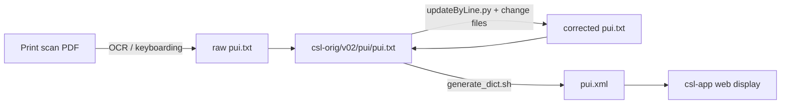

# PUI — Purāṇa Index

_Created: 05-04-2026 · Last updated: 11-07-2026_

Corrections and issue-tracking repository for the Cologne Digital Sanskrit
Lexicons digitisation of V. R. Ramachandra Dikshitar's *The Purāṇa Index*
(University of Madras, 3 vols, 1951–1955) — a comprehensive index of the
proper names, places, and subjects that occur across the eighteen
Mahāpurāṇas. The digitised text has 12,987 tokens flagged as possible
diacritic/encoding errors; this repo is where those get found, reviewed, and
turned into corrections against the canonical source.

> Note on the source: the repo code **PUI** stands for *Purāṇa Index*. Earlier
> revisions of this and sibling files misattributed the work to Vettam Mani
> (whose *Purāṇic Encyclopaedia*, Motilal Banarsidass 1975, is a separate book)
> and to Macdonell; both are corrected here. See
> [The Purāṇa Index, Vol. I (A–N)](https://archive.org/details/in.ernet.dli.2015.406618)
> on the Internet Archive.

---

## Why this repo exists

The primary source text lives in
[`csl-orig/v02/pui/pui.txt`](https://github.com/sanskrit-lexicon/csl-orig) in
the sibling `csl-orig` repository — that file is never edited directly (see the
canonical
[correction workflow](https://github.com/sanskrit-lexicon/csl-corrections/blob/main/docs/correction-workflow.md)).
Instead, this repo holds:

- **Detection scripts** that scan `pui.txt` for likely digitisation errors
  (mis-transliterated diacritics, improbable n-grams from OCR noise).
- **Per-issue folders** ([`issues/issue1/`](https://github.com/sanskrit-lexicon/PUI/tree/main/issues/issue1),
  [`issues/issue3/`](https://github.com/sanskrit-lexicon/PUI/tree/main/issues/issue3)) with the scan
  output, the change files derived from it, and the audit trail.
- **Issue tracking** against the taxonomy shared by every Sanskrit Lexicon
  dictionary repo (see [Labels](#labels) below).

Corrections never land in `csl-orig` directly from here — they're queued,
validated, and delivered in the monthly consolidated PR (`/cologne-batch-pr`).

---

## How it works



1. A detection script scans `pui.txt` and writes flagged candidates to a
   `.tsv` under `issues/issueN/`.
2. A human/agent reviews the candidates and decides which are genuine
   errors vs. legitimate proper nouns (Sanskrit names correctly carry
   diacritics — the point of
   [issue #1](https://github.com/sanskrit-lexicon/PUI/issues/1)
   was separating "real English words that slipped past OCR" from "real
   Sanskrit names", not flagging every diacritic).
3. Confirmed corrections become a change file, applied via
   [`updateByLine.py`](https://github.com/sanskrit-lexicon/csl-pywork), and
   queued for the next `csl-orig` batch PR.

---

## Usage: reproduce the issue-1 diacritic scan

[`issues/issue1/analyze_diacritics.py`](https://github.com/sanskrit-lexicon/PUI/blob/main/issues/issue1/analyze_diacritics.py)
is the actual script that produced
[`issues/issue1/non_english_sorted.tsv`](https://github.com/sanskrit-lexicon/PUI/blob/main/issues/issue1/non_english_sorted.tsv)
(12,987 flagged tokens). As committed it needs two things not present in a
fresh checkout: a hardcoded absolute path to `pui.txt` on the original
author's machine, and a live download of the `dwyl/english-words` word list
over the network — so it is not directly runnable without editing the path
and having network access.

The output `.tsv` it produced **is** committed and small enough to inspect
directly — this is the runnable, verified part:

```python
import csv, sys
sys.stdout.reconfigure(encoding='utf-8')

with open('issues/issue1/non_english_sorted.tsv', encoding='utf-8') as f:
    rows = list(csv.DictReader(f, delimiter='\t'))

print('total flagged tokens:', len(rows))
for row in rows[:5]:
    print(row['word'], row['count'])
```

Executed against this repo's checked-in data (05-07-2026):

```
total flagged tokens: 12987
Kṛṣṇa 1093
Manu 568
Brahmā 512
Śiva 502
Hari 448
```

The top hits are correctly-diacritised Sanskrit proper names (expected —
the script's job was to separate these from genuine OCR noise), which is
why issue #1 split the review into "≥6 occurrences" (high-confidence,
closed) and "≤5 occurrences" (long tail, still open as
[#4](https://github.com/sanskrit-lexicon/PUI/issues/4)).

To re-run the scan itself from scratch: edit the two hardcoded paths at the
top and bottom of `analyze_diacritics.py` to point at your local
`csl-orig/v02/pui/pui.txt` checkout and a writable output path, ensure
network access to GitHub raw content, then run:

```sh
python issues/issue1/analyze_diacritics.py
```

### issue3 — improbable n-grams

[`issues/issue3/issue3.py`](https://github.com/sanskrit-lexicon/PUI/blob/main/issues/issue3/issue3.py)
similarly scans for improbable letter sequences (OCR noise patterns like
broken word-splits: `tions`, `dence`) and wrote
[`issues/issue3/improbable_words.tsv`](https://github.com/sanskrit-lexicon/PUI/blob/main/issues/issue3/improbable_words.tsv)
(171 rows), each tagged with a pattern code (e.g. `1_mn_kg`, `2_m_tdlv`)
describing which OCR-noise heuristic flagged it.

---

## Contents

| Path | Purpose |
|---|---|
| [`issues/`](https://github.com/sanskrit-lexicon/PUI/tree/main/issues) | Per-issue correction workflows (`issue1/`, `issue3/`, …) |
| [`prefaces/`](https://github.com/sanskrit-lexicon/PUI/tree/main/prefaces) | Front-matter scan assets for OCR of the printed edition |
| [`index.html`](https://github.com/sanskrit-lexicon/PUI/blob/main/index.html) | GitHub Pages landing page (served at [sanskrit-lexicon.github.io/PUI](https://sanskrit-lexicon.github.io/PUI/)) |
| [`CITATION.cff`](https://github.com/sanskrit-lexicon/PUI/blob/main/CITATION.cff) | Machine-readable citation metadata (CFF 1.2.0) |
| [`CHANGELOG.md`](https://github.com/sanskrit-lexicon/PUI/blob/main/CHANGELOG.md) | Dated maintenance snapshots |
| [`CLAUDE.md`](https://github.com/sanskrit-lexicon/PUI/blob/main/CLAUDE.md) | Developer guidance for Claude Code agents |
| [`LICENSE`](https://github.com/sanskrit-lexicon/PUI/blob/main/LICENSE) | Repository licence |

---

## Timeline

| Period | Activity |
|---|---|
| April 2026 | Repository created; initial encoding corrections for IAST diacritics (#1, #3) |
| May 2026 | CLAUDE.md added; CITATION.cff enriched with year and (provisional) author |
| June 2026 | CHANGELOG.md added; first dated maintenance snapshot (1.0.0) |
| July 2026 | GitHub Pages landing page + `.nojekyll`; preface-scan assets added |

---

## Projects & Milestones

Counts below are current as of 11-07-2026 (verified against the live GitHub
milestones API).

| Milestone | Open | Closed | Total |
|---|---|---|---|
| Dictionary to Book | 0 | 0 | 0 |
| Digitization Quality | 1 | 2 | 3 |
| Structured Data | 1 | 0 | 1 |
| Major Enhancements | 0 | 0 | 0 |

### Closed issues

| # | Title | Type | Severity | Milestone |
|---|---|---|---|---|
| [#1](https://github.com/sanskrit-lexicon/PUI/issues/1) | Modern IAST for PUI >= 6 occurrences | `encoding` | minor | Digitization Quality |
| [#3](https://github.com/sanskrit-lexicon/PUI/issues/3) | Improbable ngrams | `text-correction` | minor | Digitization Quality |

### Open issues

| # | Title | Type | Severity | Milestone |
|---|---|---|---|---|
| [#2](https://github.com/sanskrit-lexicon/PUI/issues/2) | Questions for resolution | `question` | minor | Structured Data |
| [#4](https://github.com/sanskrit-lexicon/PUI/issues/4) | Modern IAST PUI <= 5 occurrences | `encoding` | minor | Digitization Quality |

---

## Labels

### Type labels

| Label | Description |
|---|---|
| `link-target` | Click-through from `<ls>` abbreviation to scanned PDF page |
| `link-splitting` | Split combined source references into per-page links |
| `markup` | Normalise XML tag content |
| `text-correction` | Corrections to headwords or definitions |
| `content-enhancement` | New material or display upgrades |
| `encoding` | SLP1/IAST transcoding and character normalisation |
| `scan-quality` | Replace blurry or missing scan pages |
| `bug` | Broken links, XML errors, broken downloads |
| `question` | Scholarly questions requiring research |

### Severity labels

| Label | Description |
|---|---|
| `minor` | Targeted fix — a handful of lines |
| `medium` | Standard work unit — one index or batch |
| `hard` | Large effort spanning many files |

---

## Encoding

- UTF-8 throughout; check for a BOM before editing (exports here are
  inconsistent) and preserve the file's existing state.
- The canonical source uses the standard Cologne lightweight XML markup:
  SLP1 headwords, Sanskrit wrapped in `{#…#}`, italic display text in
  `` (see the data-format table in
  [`CLAUDE.md`](https://github.com/sanskrit-lexicon/PUI/blob/main/CLAUDE.md)).
- The IAST/Devanagari display layer is generated downstream in the Cologne
  build (`generate_dict.sh` in
  [`csl-pywork`](https://github.com/sanskrit-lexicon/csl-pywork)), not in this
  repository.

---

## Source

- **Author**: Dikshitar, V. R. Ramachandra
- **Title**: *The Purāṇa Index* (Madras University Historical Series, No. 19)
- **Publisher**: Madras: University of Madras
- **Volumes / years**: Vol. I (A–N) 1951 · Vol. II (T–M) 1952 · Vol. III (Ya–H) 1955
- **Scans**: available via Cologne Digital Sanskrit Lexicon mirrors and the
  [Internet Archive](https://archive.org/details/in.ernet.dli.2015.406618)
- **Digitisation**: Cologne Digital Sanskrit Lexicon project

---

## Contributors

- [Dr. Dhaval Patel](https://github.com/drdhaval2785)
- [Mārcis Gasūns](https://github.com/gasyoun)

---

_Dr. Mārcis Gasūns_
