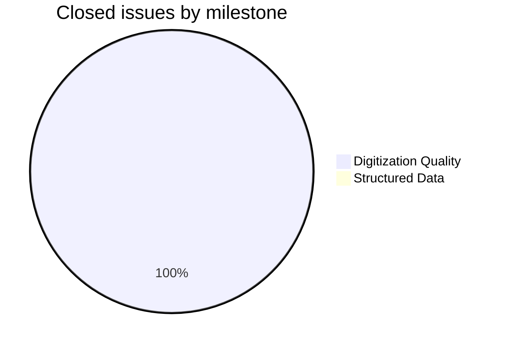
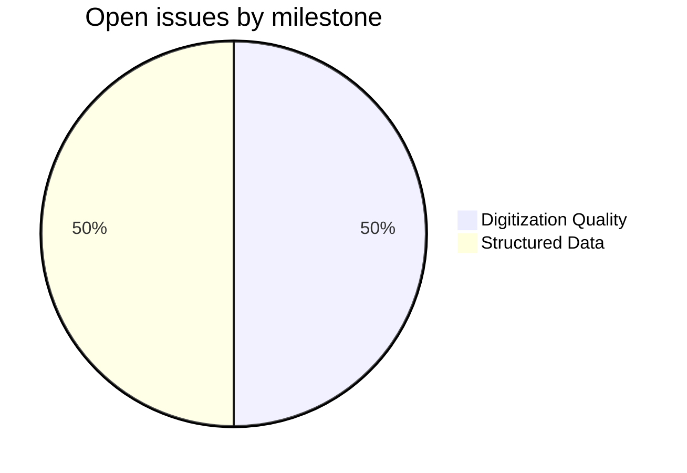
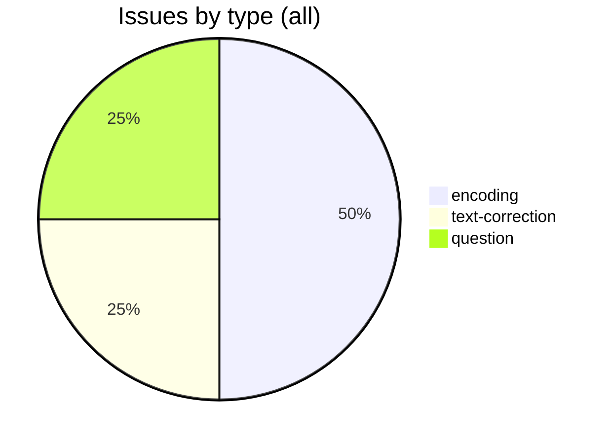
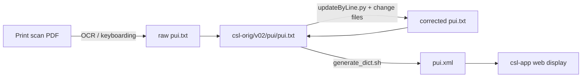

# PUI — Purana Index

Corrections and issue-tracking repository for the Cologne Digital Sanskrit Lexicons digitisation of Vettam Mani's *Purāṇic Index* (1951). The primary source text lives in [`csl-orig/v02/pui/pui.txt`](https://github.com/sanskrit-lexicon/csl-orig) in the sibling `csl-orig` repository.

---

## Contents

| Path | Purpose |
|---|---|
| `issues/` | Per-issue correction workflows (`issue1/`, `issue3/`, …) |
| `CITATION.cff` | Machine-readable citation metadata (CFF 1.2.0) |
| `CLAUDE.md` | Developer guidance for Claude Code agents |

---

## Timeline

| Period | Activity |
|---|---|
| April 2026 | Repository created; initial encoding corrections for IAST diacritics (#1, #3) |
| April–May 2026 | Minor encoding corrections per issues #1 and #4; improbable-ngram review (#3) |
| May 2026 | CLAUDE.md added; CITATION.cff enriched with author and year |

---

## Projects & Milestones

| Milestone | Open | Closed | Total |
|---|---|---|---|
| Dictionary to Book | 0 | 0 | 0 |
| Digitization Quality | 1 | 2 | 3 |
| Structured Data | 1 | 0 | 1 |
| Major Enhancements | 0 | 0 | 0 |

---

## Issue Typology

### Solved issues

| # | Title | Type | Severity | Milestone |
|---|---|---|---|---|
| [#1](https://github.com/sanskrit-lexicon/PUI/issues/1) | Modern IAST for PUI >= 6 occurrences | `encoding` | minor | Digitization Quality |
| [#3](https://github.com/sanskrit-lexicon/PUI/issues/3) | Improbable ngrams | `text-correction` | minor | Digitization Quality |

### Open issues

| # | Title | Type | Severity | Milestone |
|---|---|---|---|---|
| [#2](https://github.com/sanskrit-lexicon/PUI/issues/2) | Questions for resolution | `question` | minor | Structured Data |
| [#4](https://github.com/sanskrit-lexicon/PUI/issues/4) | Modern IAST PUI <= 5 occurrences | `encoding` | minor | Digitization Quality |

---

## Labels

### Type labels

| Label | Color | Description |
|---|---|---|
| `link-target` | `#0075ca` | Click-through from `<ls>` abbreviation to scanned PDF page |
| `link-splitting` | `#0075ca` | Split combined source references into per-page links |
| `markup` | `#0075ca` | Normalise XML tag content |
| `text-correction` | `#0075ca` | Corrections to headwords or definitions |
| `content-enhancement` | `#0075ca` | New material or display upgrades |
| `encoding` | `#0075ca` | SLP1/IAST transcoding and character normalisation |
| `scan-quality` | `#0075ca` | Replace blurry or missing scan pages |
| `bug` | `#0075ca` | Broken links, XML errors, broken downloads |
| `question` | `#0075ca` | Scholarly questions requiring research |

### Severity labels

| Label | Color | Description |
|---|---|---|
| `minor` | `#e4e669` | Targeted fix — a handful of lines |
| `medium` | `#fbca04` | Standard work unit — one index or batch |
| `hard` | `#d93f0b` | Large effort spanning many files |

---

## Encoding

- UTF-8 NFC throughout.
- Sanskrit text in SLP1 transliteration, wrapped in `{#…#}`.
- Display layer uses IAST (ISO 15919) and Devanagari, generated via `transcoder/`.
- Round-trip verified for the vast majority of entries; exceptions tracked under issue label `encoding`.

---

## How it works

---

## Source

- **Author**: Mani, Vettam
- **Title**: *The Purāṇic Encyclopaedia: A Comprehensive Work with Special Reference to the Epic and Purāṇic Literature*
- **Publisher**: Delhi: Motilal Banarsidass
- **Year(s)**: 1951 (reprint 1975)
- **Scans**: available via Cologne Digital Sanskrit Lexicon mirrors
- **First digitisation**: Cologne Digital Sanskrit Lexicon project

---

## Contributors

- [Dr. Dhaval Patel](https://github.com/drdhaval2785)
- [Mārcis Gasūns](https://github.com/gasyoun)
